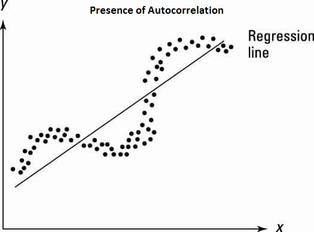
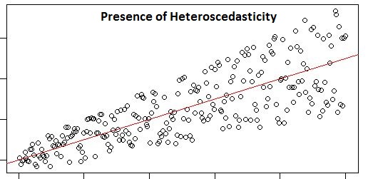

# linear_regression

1. Simple Linear Regression
2. Multiple Linear Regression

# What is Regression?
Regression is a handy tool to find relationships between dependent variables and independent variables. However, we cannot always fit a regression line to any given dataset.

# Assumptions
Regression is a 'Parametric' algorithm, hence the algorithm makes some assumptions about the data before performing the analysis. Regression can't work to its fullest if the assumptions are not met, and therefore, for a well-fitted model, you are always required to check the assumptions and validate them.
The various assumptions that are made for linear regression are as follows:

- Linearity
- Outliers
- Autocorrelation
- Multicollinearity
- Heteroskedasticity

# Linearity
The relationship between an independent variable and a dependent variable needs to be linear for you to perform linear regression on it. If you build a linear model for a non-linear dataset, your model will fail to capture the trend, and it will also fail to read/analyse the unseen dataset.
To check for linearity, you can create a scatter plot of the data and check whether the line fits the data points or not. In cases where the raw variables are non-linear, we try to find new features that have a linear behaviour .

# Outliers
Outliers can deviate from the fitted line, which will eventually be incorrect for any further predictions. This will also affect the coefficients and compel them to change the sign. If the data has many outliers, it is good to run a separate regression for both, i.e. one with outliers and another without outliers and choose the one which suits the problem statement and the need to remove outliers.

# Autocorrelation
Autocorrelation mostly occurs in time series data; it refers to the presence of correlation in error terms. In the presence of autocorrelation in data, the errors influence one another.
Let's understand autocorrelation through an example. If the change in the income of a person A affects the savings of person B, then autocorrelation is present.

To check for autocorrelation, you can run the Durbin – Watson (DW) statistic. The value should lie between 0 and 4. You can also plot residual versus time plot, and you can check for the correlated pattern in the residual values. 

 

Multicollinearity
If the independent variables are correlated with each other, then you can say that multicollinearity exists in your data. The presence of multicollinearity makes it difficult to estimate the true relationship between the dependent variable and the independent variable. Multicollinearity also affects the coefficients, which, in turn, will affect the predictions.

 

To check for multicollinearity, you can use a scatter plot between the independent variables and can look for VIF values. A VIF value of 4 or less indicates no multicollinearity. 

# Heteroskedasticity
Heteroscedasticity means unequal scatter, which means that the variance of residuals should not increase with the fitted values of the response variable. The presence of heteroscedasticity implies that you want your points to look like a funnel.

To check for heteroscedasticity, you can look for a residual versus fitted values plot. If heteroskedasticity exists, the plot will exhibit a funnel-shaped pattern.

# Model Building Steps
Steps we will use throughout the linear regression model building process:

1. Once you understood the business objective, you prepared the data, followed by EDA and the division of data into training and test datasets.

2. The next step was the selection of variables for the creation of the model. Variable selection is critical because you cannot just include all the variables in the model; otherwise, you run the risk of including insignificant variables too.

3. This is RFE can be used to quickly shortlist some variables which are significant to save time.

4. However, these significant independent variables might be related to each other. This is where you need to check for multicollinearity amongst variables using variance inflation factor (VIF) and remove variables with high VIF and low significance (p>0.05).
5. The variables with a high VIF or multicollinearity may be statistically significant or p<0.05, in which case you will first have to check for other insignificant variables (p>0.05) before removing the variables with a higher VIF and lower p-values.

6. Continue removing the variables until all variables are significant or p<0.05, and have low VIFs.

7. Finally you arrive at a model where all variables are significant and there is no threat of multicollinearity. 

8. The final step is to check the model accuracy on the testing data.